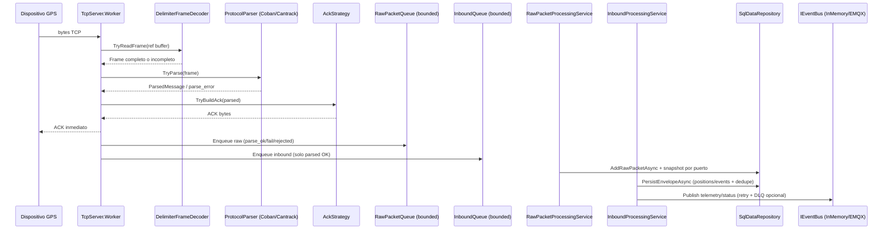
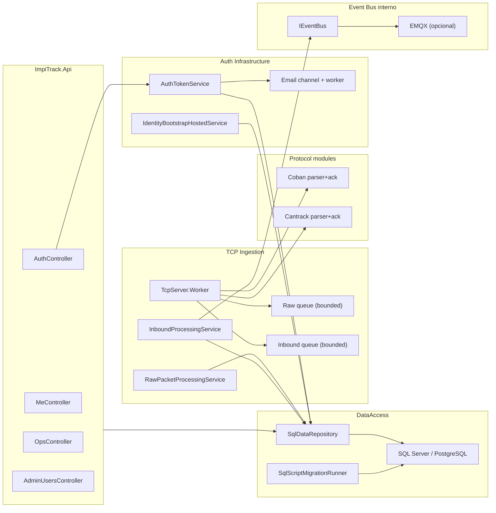
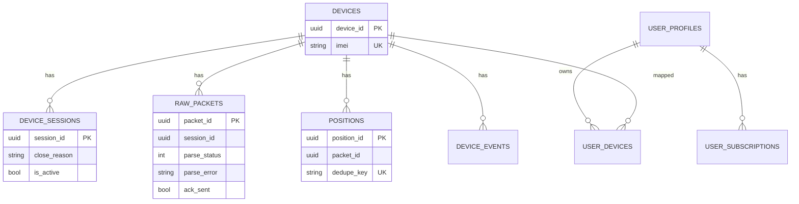

# IMPITrack Backend Maintenance Guide (.NET 10)

## 1. Objetivo
Esta guia documenta el backend actual de IMPITrack para mantenimiento, operacion diaria y evolucion incremental sin reescrituras masivas.  
Cobertura: `TcpServer` (ingesta TCP), `ImpiTrack.Api` (Auth/Ops/Usuarios), capa `Application`, capa `DataAccess`, observabilidad, pruebas y bus interno de eventos (InMemory/EMQX).

No cubre frontend.

## 2. Estado actual (resumen ejecutivo)
- Arquitectura: monolito modular, separado por proyectos.
- Ingesta TCP robusta: framing por delimitador, ACK temprano, backpressure con canales bounded, limites/timeouts y control de abuso por IP.
- Persistencia SQL dual para negocio (SQL Server + Postgres) con scripts por proveedor.
- Identity/API: SQL Server o InMemory. Postgres para Identity esta diferido (bloqueado por version actual de dependencias).
- Event Bus interno: `InMemory` listo y `EMQX` via MQTTnet listo para publicacion.
- API con respuestas estandarizadas (`ApiResponse<T>`) y middleware global de errores.

## 3. Mapa real del repositorio

| Proyecto | Responsabilidad principal | Archivos clave |
|---|---|---|
| `TcpServer` | Listener TCP, ACK, colas, workers background | `Program.cs`, `ServiceCollectionExtensions.cs`, `Worker.cs`, `InboundProcessingService.cs`, `RawPacketProcessingService.cs`, `EventBus/EmqxMqttEventBus.cs` |
| `ImpiTrack.Tcp.Core` | Contratos y piezas tecnicas de TCP | `Configuration/*`, `Framing/DelimiterFrameDecoder.cs`, `Queue/*`, `Sessions/*`, `Protocols/*`, `EventBus/*` |
| `ImpiTrack.Protocols.Coban` | Parser + ACK Coban | `CobanProtocolParser.cs`, `CobanAckStrategy.cs` |
| `ImpiTrack.Protocols.Cantrack` | Parser + ACK Cantrack | `CantrackProtocolParser.cs`, `CantrackAckStrategy.cs` |
| `ImpiTrack.Protocols.Abstractions` | Modelos canonicos de protocolo/eventos | `ParsedMessage.cs`, `Frame.cs`, `TelemetryEvents.cs`, enums |
| `ImpiTrack.DataAccess` | Repositorios SQL/InMemory, migraciones, factory de conexion | `Extensions/ServiceCollectionExtensions.cs`, `Repositories/SqlDataRepository.cs`, `Migrations/SqlScriptMigrationRunner.cs`, `db/sqlserver/*`, `db/postgres/*` |
| `ImpiTrack.Api` | API HTTP (Auth, Ops, Me, Admin), middleware, OpenAPI/Scalar | `Program.cs`, `Controllers/*`, `Auth/Controllers/AuthController.cs`, `Http/*` |
| `ImpiTrack.Auth.Infrastructure` | Identity, JWT, refresh tokens, bootstrap admin/roles, email | `Extensions/ServiceCollectionExtensions.cs`, `Auth/Services/AuthTokenService.cs`, `Auth/Services/IdentityBootstrapHostedService.cs`, `Email/Services/*`, `Identity/*` |
| `ImpiTrack.Application` | Casos de uso de negocio (Me/Admin) | `Services/MeAccountService.cs`, `Services/AdminUsersService.cs` |
| `ImpiTrack.Ops` | Modelos de observabilidad operativa y correlacion | `Models.cs` |
| `ImpiTrack.Observability` | Metricas (`Meter`) del pipeline | `ITcpMetrics.cs`, `TcpMetrics.cs` |
| `ImpiTrack.Tests` | Unit + integration tests (.NET 10) | `DelimiterFrameDecoderTests.cs`, `QueueBackpressureTests.cs`, `TcpServerIntegrationTests.cs`, `Api*Tests.cs` |

## 4. Flujo end-to-end (socket -> DB -> eventos)

### 4.1 Pipeline TCP principal


### 4.2 Diagrama de componentes backend


## 5. Framing, ACK y backpressure (reglas operativas)

### Framing robusto
- Implementacion: `ImpiTrack.Tcp.Core/Framing/DelimiterFrameDecoder.cs`.
- Soporta frames concatenados e incompletos.
- Descarta delimitadores vacios repetidos.
- Aplica `MaxFrameBytes`; si excede, lanza `InvalidDataException` y el worker registra `frame_rejected`.

### ACK rapido y correcto
- ACK se envia en `Worker` justo despues de parseo valido, antes de persistencia.
- Coban:
  - login (`##...`) -> `LOAD`
  - heartbeat/tracking -> `ON\r\n`
- Cantrack:
  - ACK = echo del payload recibido.

### Backpressure
- Cola de inbound: `InMemoryInboundQueue` con `Channel<T>` bounded y `FullMode=Wait`.
- Cola raw: `InMemoryRawPacketQueue` bounded con modos configurables:
  - `Wait`
  - `Drop`
  - `Disconnect`
- Config clave: `TcpServerConfig:Pipeline:*`.

## 6. Persistencia y modelo de datos

### 6.1 Estrategia multi-db actual
- Repositorio SQL unico con dialeto por proveedor en `SqlDataRepository`.
- Proveedor seleccionado por `Database:Provider`.
- Conexion via `DbConnectionFactory` (`SqlConnection` o `NpgsqlConnection`).
- Migraciones SQL por scripts embebidos por proveedor:
  - `ImpiTrack.DataAccess/db/sqlserver/*.sql`
  - `ImpiTrack.DataAccess/db/postgres/*.sql`

### 6.2 Dedupe/idempotencia
- Tracking dedupe key: SHA256 estable de `imei|gpsTime|messageType|lat|lon`.
- SQL Server: insert condicionado (`IF NOT EXISTS ... dedupe_key`).
- Postgres: `ON CONFLICT (dedupe_key) DO NOTHING`.
- Resultado de persistencia:
  - `Persisted`
  - `Deduplicated`
  - `SkippedUnownedDevice` (imei no vinculado a usuario).

### 6.3 Tablas operativas clave (alto nivel)


## 7. API y relacion con TCP server

### 7.1 Que hace la API
- Auth y sesiones JWT: `api/auth/*`.
- Vinculo usuario <-> IMEI y cuota por plan: `api/me/*`, `api/admin/users/*`.
- Observabilidad operacional del pipeline TCP: `api/ops/*`.
- Health/readiness: `/health`, `/ready`.

### 7.2 Como se conectan API y TCP
- No hay llamada HTTP directa entre procesos.
- Ambos comparten la misma capa de datos (`ImpiTrack.DataAccess`) y por eso:
  - El `TcpServer` persiste `raw_packets`, `positions`, `device_sessions`.
  - La API consulta esos datos en endpoints `ops`.
  - La API administra ownership y planes; eso afecta si un inbound se persiste como telemetria o se omite.

## 8. Configuracion critica

### 8.1 Archivos
- TCP: `ImpiTrack/TcpServer/appsettings.json` y `appsettings.Development.json`
- API: `ImpiTrack/ImpiTrack.Api/appsettings.json` y `appsettings.Development.json`

### 8.2 Claves de mayor impacto
- `Database:Provider` = `SqlServer | Postgres | InMemory`
- `Database:EnableAutoMigrate` = aplica scripts al iniciar.
- `TcpServerConfig:Servers` = puertos/protocolos.
- `TcpServerConfig:Socket:*` = limites y timeouts.
- `TcpServerConfig:Pipeline:*` = capacidades/consumidores.
- `TcpServerConfig:Security:*` = rate/invalid/ban.
- `EventBus:Provider` = `InMemory | Emqx`.
- `IdentityStorage:Provider` (API) = `SqlServer | InMemory`.
- `Email:Enabled`, `Email:Smtp:*`, `Email:VerifyEmailBaseUrl`.

### 8.3 Limitacion conocida importante
- `IdentityStorage:Provider = Postgres` en API falla por restriccion actual de dependencias.
- `Program.cs` de API lanza exception explicita para proteger startup.

## 9. Runbook de operacion local

### 9.1 Build y tests
```powershell
dotnet restore ImpiTrack/ImpiTrack.sln
dotnet build ImpiTrack/ImpiTrack.sln -c Debug
dotnet test ImpiTrack/ImpiTrack.sln -c Debug --no-build
```

### 9.2 Arranque manual
```powershell
dotnet run --project ImpiTrack/ImpiTrack.Api/ImpiTrack.Api.csproj
dotnet run --project ImpiTrack/TcpServer/TcpServer.csproj
```

### 9.3 Prueba TCP rapida (sin GPS fisico)
```powershell
.\ImpiTrack\Tools\Send-TcpPayload.ps1 -Port 5001 -Payload "##,imei:359586015829802,A;"
.\ImpiTrack\Tools\Send-TcpPayload.ps1 -Port 5001 -Payload "imei:359586015829802,tracker,250301123045,,A;"
.\ImpiTrack\Tools\Send-TcpPayload.ps1 -Port 5002 -Payload "*HQ,359586015829802,V0#"
```

### 9.4 Prueba de proveedor SQL (API readiness)
```powershell
.\ImpiTrack\Tools\Run-ProviderSmoke.ps1 -Provider SqlServer
# CI/no binarios previos
.\ImpiTrack\Tools\Run-ProviderSmoke.ps1 -Provider SqlServer -BuildBeforeRun
```

### 9.5 Smoke EMQX automatizado
```powershell
.\ImpiTrack\Tools\Run-EmqxSmoke.ps1
# CI/no binarios previos
.\ImpiTrack\Tools\Run-EmqxSmoke.ps1 -NoBuild -StartupTimeoutSeconds 120 -TopicTimeoutSeconds 30
```

### 9.7 Smoke CI (GitHub + Azure DevOps)
- GitHub Actions: `.github/workflows/backend-smoke.yml`
- Azure DevOps: `azure-pipelines.yml`
- Ambos pipelines ejecutan:
  - `dotnet restore/build/test`
  - `Run-ProviderSmoke.ps1 -Provider SqlServer`
  - `Run-EmqxSmoke.ps1`
  - publicacion de logs de `.artifacts/*`

### 9.6 Levantar stack de observabilidad local
```powershell
docker compose -f .\ImpiTrack\Observability\docker-compose.observability.yml up -d
```

Credenciales Grafana por defecto:
- user: `admin`
- password: `admin`

## 10. Observabilidad y diagnostico

### 10.1 Logs relevantes
- Worker:
  - `session_open`, `session_closed`, `session_error`
  - `parse_fail`, `frame_rejected`
  - `ack_sent`
  - `frame_enqueued`
  - `raw_queue_drop`
- API:
  - `api_unhandled_exception`
  - `health_ready_storage_check_failed`
  - eventos de auth/email/identity bootstrap.

### 10.2 Metricas (`ImpiTrack.Observability/TcpMetrics.cs`)
- conexiones: `tcp_connections_active`
- trafico: `tcp_frames_in_total`, `tcp_frames_invalid_total`
- parse: `tcp_parse_ok_total`, `tcp_parse_fail_total`
- ack: `tcp_ack_sent_total`, `tcp_ack_latency_ms`
- colas: `tcp_queue_backlog`, `tcp_raw_queue_backlog`, `tcp_raw_queue_drops_total`
- persistencia: `tcp_persist_latency_ms`, `tcp_dedupe_drops_total`
- bus interno: `tcp_event_publish_ok_total`, `tcp_event_publish_fail_total`, `tcp_event_publish_retry_total`, `tcp_event_dlq_total`

### 10.3 Reglas de alerta SLO
- Archivo: `ImpiTrack/Observability/prometheus-rules.yml`
- Alertas incluidas:
  - `ImpiTrackParseFailRatioHigh`
  - `ImpiTrackAckP95High`
  - `ImpiTrackPersistP95High`
  - `ImpiTrackInboundBacklogHigh`
  - `ImpiTrackRawQueueDropsDetected`

## 11. Troubleshooting (casos reales)

### Error: `Invalid object name 'IdentityRoles'`
- Causa: esquema Identity no migrado.
- Accion:
  1. Verificar `IdentityStorage:Provider=SqlServer`.
  2. Asegurar `ConnectionStrings:IdentitySqlServer`.
  3. Levantar API en `Development` para que `Database.MigrateAsync()` de Identity aplique.

### Error: `Invalid object name 'user_profiles'` o `dedupe_key`
- Causa: migraciones DataAccess incompletas.
- Accion:
  1. `Database:EnableAutoMigrate=true` temporalmente.
  2. Reiniciar API.
  3. Verificar tabla `schema_migrations`.

### Error TCP `SocketException (10053)`
- Causa comun: cliente de prueba cierra conexion luego del envio.
- Accion: si hay `session_closed` con razon esperada y ACK enviado, no es incidente.

### Link de confirmacion email no funciona
- Revisar `Email:VerifyEmailBaseUrl` (host/puerto/path correctos).
- Debe apuntar a `GET /api/auth/verify-email/confirm`.

## 12. Playbook de extension (sin romper arquitectura)

### 12.1 Agregar nuevo protocolo GPS
1. Crear parser en nuevo proyecto `ImpiTrack.Protocols.<Marca>` implementando `IProtocolParser`.
2. Crear estrategia ACK `IAckStrategy`.
3. Registrar en `TcpServer/ServiceCollectionExtensions.cs`.
4. Agregar mapping por puerto en `TcpServerConfig:Servers`.
5. Agregar tests:
   - parser
   - ACK
   - integracion TCP.

### 12.2 Agregar nuevo endpoint API
1. Crear caso de uso en `ImpiTrack.Application`.
2. Exponer desde controlador en `ImpiTrack.Api/Controllers`.
3. Reutilizar envelope `ApiResponseFactory` y `ControllerProblemExtensions`.
4. Agregar pruebas de integracion en `ImpiTrack.Tests`.

### 12.3 Agregar cambio de esquema SQL
1. Agregar script en ambos proveedores:
   - `db/sqlserver/Vxxx__*.sql`
   - `db/postgres/Vxxx__*.sql`
2. Mantener semantica equivalente entre motores.
3. Verificar orden/version en `schema_migrations`.
4. Correr smoke SQL Server.

### 12.4 Cambiar Event Bus a EMQX
1. Configurar en TCP:
   - `EventBus:Provider=Emqx`
   - host/port/clientId/credenciales.
2. Verificar publish de `v1/telemetry/{imei}` y `v1/status/{imei}`.
3. Simular fallo para validar `v1/dlq/{topic}` si `EnableDlq=true`.

## 13. Checklist de release backend
- `dotnet build` y `dotnet test` en verde.
- Pipelines CI en verde:
  - GitHub Actions `backend-smoke`
  - Azure DevOps `azure-pipelines`
- `Database:Provider` correcto para entorno.
- Migraciones aplicadas sin pendientes.
- `/health` y `/ready` responden OK.
- Flujo minimo probado:
  - register -> verify-email -> login
  - bind device
  - envio TCP + ACK
  - consulta `api/ops/raw/latest`
- Validar logs de correlacion (`sessionId`, `packetId`, `imei`).
- Si se usa EMQX, validar publish y DLQ.

## 14. Deuda tecnica conocida y siguiente paso recomendado
- Claves deprecadas en pipeline TCP:
  - `ParserWorkers` y `DbWorkers` fueron retiradas.
  - solo `ConsumerWorkers` es valida para workers inbound.
- En Identity PostgreSQL se usa `EnsureCreated` para bootstrap inicial en Development.
  - estrategia formal en ADR: `Docs/ADR-001-IDENTITY-POSTGRES-ENABLEMENT.md`.
- Siguiente iteracion recomendada:
  1. ajustar umbrales SLO segun trafico real por entorno,
  2. agregar destino de notificaciones (PagerDuty/Teams/Slack) para alertas criticas,
  3. ejecutar plan de habilitacion de Identity Postgres segun ADR.
