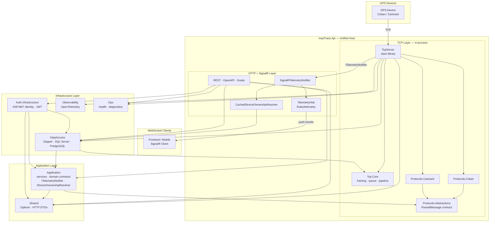
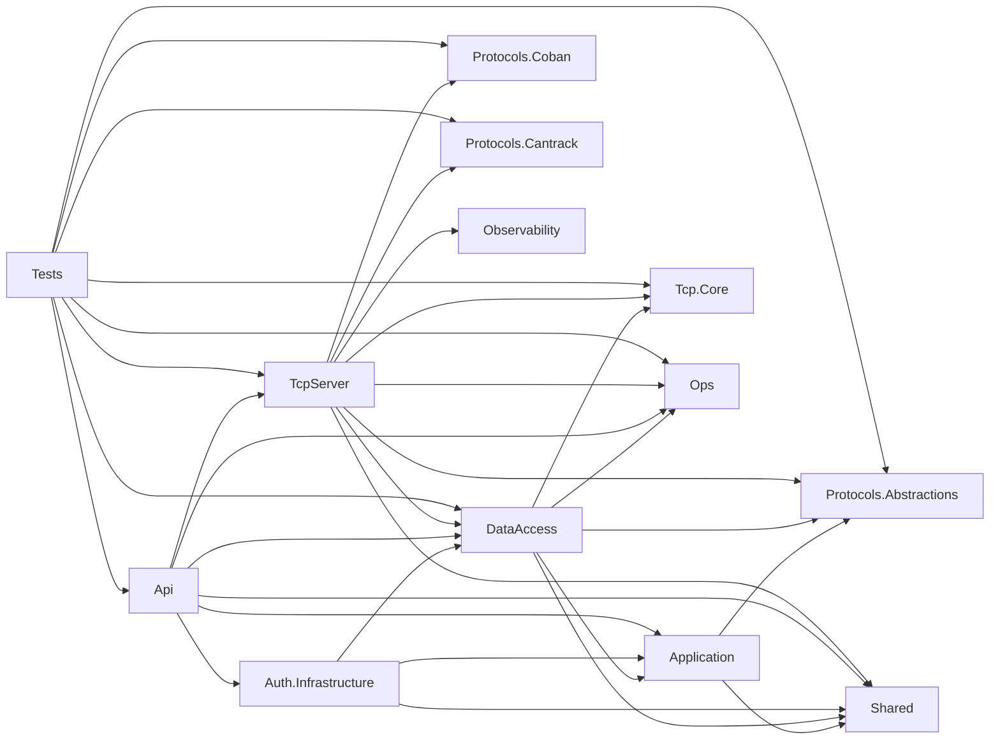

# IMPITrack

Role: index  
Status: active  
Owner: backend-maintainers  
Last Reviewed: 2026-03-19

This README is the stable entry point for project documentation.

## Start Here

- Current backend/runtime truth: [`ImpiTrack/Docs/CURRENT_STATE.md`](ImpiTrack/Docs/CURRENT_STATE.md)
- Documentation map: [`ImpiTrack/Docs/README.md`](ImpiTrack/Docs/README.md)
- Active runbooks: [`ImpiTrack/Docs/runbooks/README.md`](ImpiTrack/Docs/runbooks/README.md)
- Architecture decisions: [`ImpiTrack/Docs/adr/README.md`](ImpiTrack/Docs/adr/README.md)
- Historical plans and PRDs: [`ImpiTrack/Docs/history/README.md`](ImpiTrack/Docs/history/README.md)

## Current Project Snapshot

- Backend repo only; frontend is out of scope for this repository.
- Runtime shape today: single unified process — `ImpiTrack.Api` hosts HTTP, SignalR, and TCP ingestion (via `TcpServer` class library). No separate TCP process.
- Current dev defaults in repo config: SQL Server for persistence and Identity, CORS origins configured for localhost, OpenAPI + Scalar + SignalR enabled in API Development.

## Architecture

### System Layers

### Project Dependency Graph

Shows direct `<ProjectReference>` edges between projects (verified from `.csproj` files):

`Protocols.Abstractions` and `Shared` have no inward project dependencies. `Application` does not reference `DataAccess` — repository interfaces are defined in `Application.Abstractions/` and implemented by `DataAccess`, satisfying Dependency Inversion.

For the full architecture narrative, see [`ImpiTrack/Docs/CURRENT_STATE.md`](ImpiTrack/Docs/CURRENT_STATE.md).

## Documentation Rules

- Put current architecture, runtime, dependencies, limits, and governance updates in [`ImpiTrack/Docs/CURRENT_STATE.md`](ImpiTrack/Docs/CURRENT_STATE.md).
- Keep `README.md` short. If it starts becoming a wiki again, move the detail to the canonical docs and link it.
- Historical or superseded docs are not current truth. They must say so explicitly and point to the canonical replacement.
